# 👥 Use Case Diagram — Makarya
**Versi:** 1.0

---

## Diagram Use Case

```mermaid
graph TD
    UMKM(["👤 UMKM (Klien)"])
    MHS(["👤 Mahasiswa (Freelancer)"])
    ADMIN(["👤 Admin"])
    AI(["🤖 Sistem AI (Opsional)"])
    MIDTRANS(["💳 Midtrans"])
    FCM(["🔔 Firebase FCM"])

    subgraph AUTH ["Autentikasi & Profil"]
        UC_REG["Registrasi Akun"]
        UC_LOGIN["Login / Logout"]
        UC_PROFILE["Kelola Profil"]
        UC_VERIFY["Verifikasi Mahasiswa"]
    end

    subgraph PROJ ["Manajemen Proyek"]
        UC_POST["Posting Proyek Baru"]
        UC_AI_TAG["Auto-tag Skill (AI)"]
        UC_PRICE["Smart Pricing Suggester"]
        UC_TRACK["Live Project Tracker"]
        UC_EDIT_PROJ["Edit / Hapus Proyek"]
    end

    subgraph PROPOSAL ["Proposal & Seleksi"]
        UC_BROWSE["Browse & Filter Proyek"]
        UC_SEND_PROP["Kirim Proposal"]
        UC_PROP_BOARD["Proposal Board"]
        UC_ACC_REJ["Terima / Tolak Proposal"]
    end

    subgraph WORK ["Pengerjaan & Pengiriman"]
        UC_UPLOAD["Upload Hasil Kerja"]
        UC_REVIEW["Review & Approve Hasil"]
        UC_REVISE["Request Revisi (Maks 2x)"]
        UC_RATING["Beri Rating & Review"]
    end

    subgraph FIN ["Keuangan & Escrow"]
        UC_TOPUP["Top-up via Midtrans"]
        UC_ESCROW["Hold / Release Escrow"]
        UC_WITHDRAW["Request Withdraw"]
    end

    subgraph ADMIN_MOD ["Admin Dashboard"]
        UC_ADMIN_PANEL["Pantau Proyek & Transaksi"]
        UC_DISPUTE["Dispute Resolution"]
        UC_SUSPEND["Suspend / Ban Akun"]
        UC_MASTER["Kelola Master Data"]
    end

    subgraph NOTIF ["Notifikasi"]
        UC_NOTIF["Push Notification"]
    end

    %% UMKM Use Cases
    UMKM --> UC_REG
    UMKM --> UC_LOGIN
    UMKM --> UC_PROFILE
    UMKM --> UC_POST
    UMKM --> UC_PRICE
    UMKM --> UC_TRACK
    UMKM --> UC_EDIT_PROJ
    UMKM --> UC_ACC_REJ
    UMKM --> UC_REVIEW
    UMKM --> UC_REVISE
    UMKM --> UC_RATING
    UMKM --> UC_TOPUP

    %% Mahasiswa Use Cases
    MHS --> UC_REG
    MHS --> UC_LOGIN
    MHS --> UC_PROFILE
    MHS --> UC_BROWSE
    MHS --> UC_SEND_PROP
    MHS --> UC_PROP_BOARD
    MHS --> UC_UPLOAD
    MHS --> UC_WITHDRAW

    %% Admin Use Cases
    ADMIN --> UC_VERIFY
    ADMIN --> UC_ADMIN_PANEL
    ADMIN --> UC_DISPUTE
    ADMIN --> UC_SUSPEND
    ADMIN --> UC_MASTER

    %% AI (opsional)
    UC_POST -.->|"«extend»"| UC_AI_TAG
    UC_AI_TAG --> AI

    %% External services
    UC_TOPUP --> MIDTRANS
    UC_ESCROW --> MIDTRANS
    UC_NOTIF --> FCM

    %% Sistem internal trigger notif
    UC_ACC_REJ -.->|"«include»"| UC_NOTIF
    UC_REVIEW -.->|"«include»"| UC_NOTIF
    UC_TOPUP -.->|"«include»"| UC_ESCROW
```



---

## Deskripsi Use Case Detail

### Autentikasi & Profil

| ID | Nama Use Case | Aktor | Deskripsi Singkat |
|----|---------------|-------|-------------------|
| UC-AUTH-01 | Registrasi Akun | UMKM, Mahasiswa | Daftar akun baru. Mahasiswa wajib email `.ac.id` atau upload KTM |
| UC-AUTH-02 | Login / Logout | Semua | Login menghasilkan JWT access + refresh token |
| UC-AUTH-03 | Kelola Profil | UMKM, Mahasiswa | Edit data profil, foto, skill (mahasiswa), info usaha (UMKM) |
| UC-AUTH-04 | Verifikasi Mahasiswa | Admin | Admin mengecek KTM dan mengaktifkan akun mahasiswa secara manual |

---

### Manajemen Proyek (UMKM)

| ID | Nama Use Case | Aktor | Pre-condition | Post-condition |
|----|---------------|-------|---------------|----------------|
| UC-PROJ-01 | Posting Proyek | UMKM | Akun terverifikasi, wallet diisi | Proyek tampil di browse mahasiswa |
| UC-PROJ-02 | Smart Pricing | UMKM | Mengetik budget | Muncul estimasi harga wajar |
| UC-PROJ-03 | Auto-tag AI | Sistem AI | Proyek baru dibuat | Skill tag otomatis terpasang |
| UC-PROJ-04 | Live Tracker | UMKM | Proyek aktif ada | Melihat status visual proyek |
| UC-PROJ-05 | Edit/Hapus Proyek | UMKM | Belum ada proposal | Data proyek diperbarui atau dihapus |

---

### Proposal & Seleksi

| ID | Nama Use Case | Aktor | Pre-condition | Post-condition |
|----|---------------|-------|---------------|----------------|
| UC-PROP-01 | Browse Proyek | Mahasiswa | Login, akun aktif | Melihat daftar proyek terbuka |
| UC-PROP-02 | Kirim Proposal | Mahasiswa | Proyek berstatus OPEN | Proposal masuk dengan status PENDING |
| UC-PROP-03 | Proposal Board | Mahasiswa | Ada proposal dikirim | Dashboard semua proposal mahasiswa |
| UC-PROP-04 | Terima/Tolak Proposal | UMKM | Ada proposal PENDING | Status berubah, notifikasi dikirim ke mahasiswa |

---

### Pengerjaan & Pengiriman

| ID | Nama Use Case | Aktor | Pre-condition | Post-condition |
|----|---------------|-------|---------------|----------------|
| UC-WORK-01 | Upload Hasil | Mahasiswa | Proposal berstatus ACCEPTED | File tersimpan, status SUBMITTED |
| UC-WORK-02 | Approve Hasil | UMKM | Submission ada | Escrow release ke mahasiswa, proyek DONE |
| UC-WORK-03 | Request Revisi | UMKM | `jumlah_revisi` < 2 | Counter revisi +1, status REVISION_REQUESTED |
| UC-WORK-04 | Beri Rating | UMKM | Proyek berstatus DONE | Rating tersimpan, rating_avg mahasiswa diperbarui |

**Aturan Bisnis Revisi:**
```
IF submissions.jumlah_revisi >= 2:
    Tombol "Minta Revisi" → DISABLED
    Return 400: "Batas revisi maksimal telah tercapai"
```

---

### Keuangan & Escrow

| ID | Nama Use Case | Aktor | Deskripsi |
|----|---------------|-------|-----------|
| UC-FIN-01 | Top-up | UMKM | Bayar via VA/QRIS Midtrans → `saldo_aktif` bertambah |
| UC-FIN-02 | Hold Escrow | Sistem | Saat proposal diterima → `saldo_aktif` UMKM berkurang, `saldo_escrow` bertambah |
| UC-FIN-03 | Release Escrow | Sistem | Saat UMKM approve → `saldo_escrow` → `saldo_aktif` mahasiswa |
| UC-FIN-04 | Withdraw | Mahasiswa | Request penarikan → Admin proses manual |

**Alur Escrow:**
```
UMKM Top-up
    → saldo_aktif UMKM +X

UMKM Terima Proposal (nilai = harga_tawar)
    → saldo_aktif UMKM -harga_tawar
    → saldo_escrow UMKM +harga_tawar
    [Dana aman, belum ke mahasiswa]

UMKM Approve Hasil Kerja
    → saldo_escrow UMKM -harga_tawar
    → saldo_aktif Mahasiswa +harga_tawar
    [Dana cair ke mahasiswa]

Mahasiswa Request Withdraw
    → Admin proses manual transfer bank
    → saldo_aktif Mahasiswa -nominal
```
